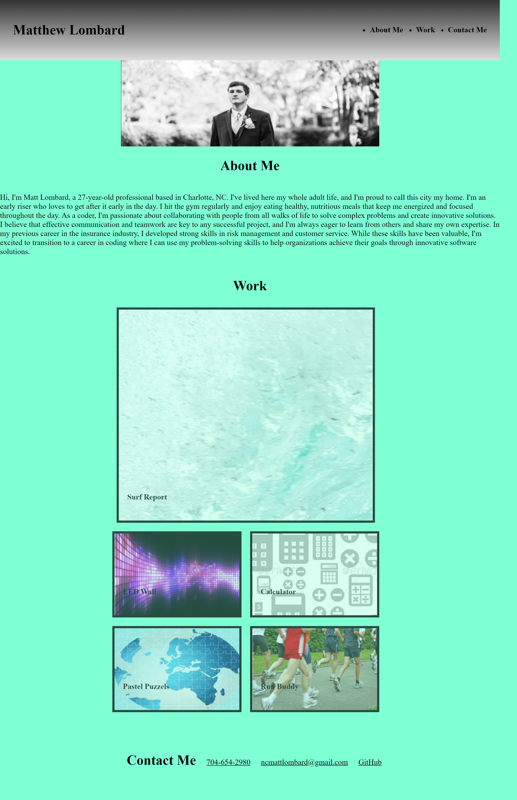

# Matt-Lombard-Portfolio

## Description

The motivation behind this project was to create a consolidated location where all of my professional or academic work could be showcased in a visually appealing and easy-to-navigate format. As a bootcamp student, it is important to have a portfolio of my coding work that can be presented to future employers.

This project helps solve the problem of having scattered pieces of work in different locations by providing a central hub where my best work can be easily accessed and viewed by potential employers.

In the process of building this project, I had the opportunity to learn more advanced techniques in CSS and the use of cards. This allowed me to create a visually engaging and well-structured portfolio that showcases my coding skills and abilities in an organized and professional manner.

Overall, this project not only serves as a great tool to present to potential employers but also highlights my growth and development as a web developer.

https://mattlombard.github.io/Matt-Lombard-Portfolio/
## Usage

About Me: In the "About Me" section, I introduce myself and provide some background information about my experience as a web developer. This section is meant to give potential employers or clients an idea of my personality and my work style.

My Work: The "My Work" section consists of five cards that highlight my best coding projects. Each card features a thumbnail image of the project, a brief description of the project's goals, and a link to view the project. Clicking on a card will take the user directly to the corresponding project.

Contact Me: The final section of my portfolio is the "Contact Me" page, where potential employers or clients can get in touch with me. This section includes my email address and links to my social media profiles, allowing visitors to easily connect with me online.

Overall, my portfolio is a great tool for showcasing my work and skills as a web developer. Whether I'm looking for a job or trying to build my client base, this portfolio can help me present my best work and attract potential employers or clients.

## Credits

Used code for reference from the Git-Lab-Class Files (-01-HTML-Git-CSS and 02-Advanced-CSS) as well as code from my module 1 assignment (https://github.com/MattLombard/SEO-Experts)

Collaborated with: Sarah Miller, Chris Snyeder, Christian Martinez and Tyrrance Milller.

## License

MIT